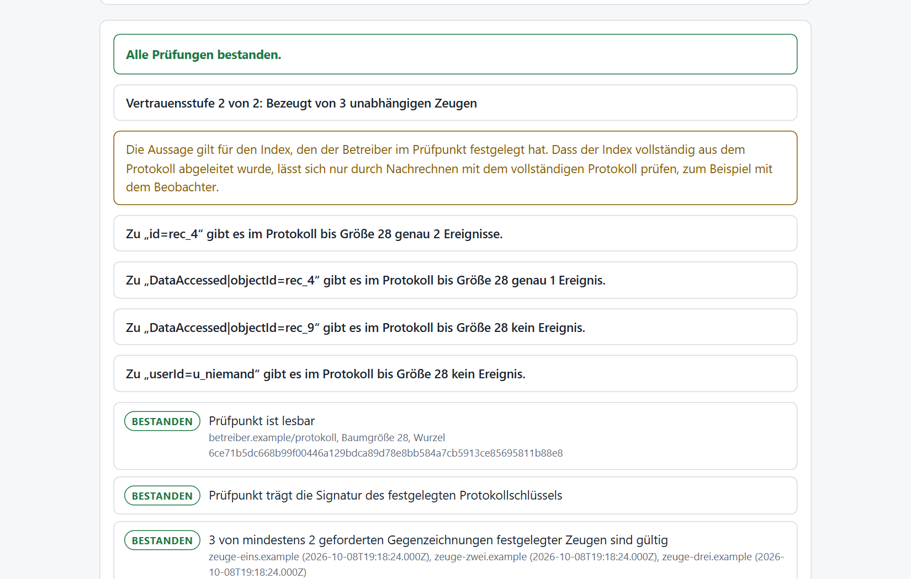
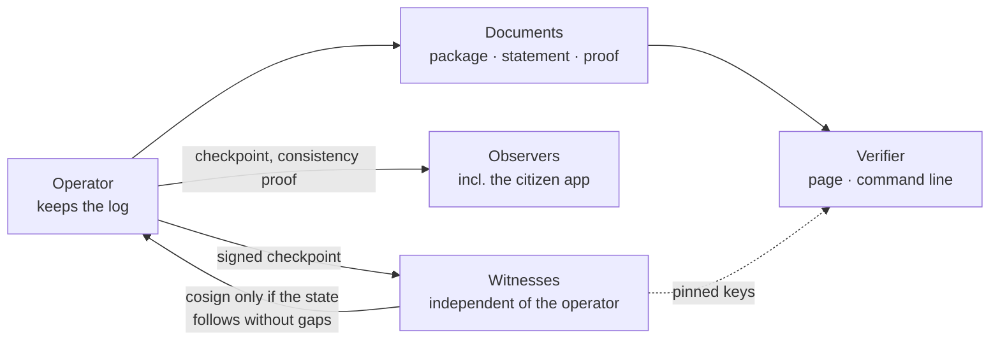

<div align="center">

<picture>
  <source media="(prefers-color-scheme: dark)" srcset="docs/assets/defconder-logo-dunkel.svg">
  
</picture>

# Verifier

**Verify, do not trust.** Open tools to check claims about a tamper-evident log without the application behind it: in the browser, on the command line, and in three implementations.

[](https://github.com/defconder/pruefer/actions/workflows/tests.yml)
[](LICENSE)


[Quick start](#quick-start) · [Document types](#document-types) · [How it works](#how-it-works) · [Specification](pruefer/SPECIFICATION.en.md) · [Threat model](pruefer/THREAT_MODEL.en.md) · [Deutsch](README.md)

</div>

---

## What this is

Whoever keeps a log can rewrite it, and a checksum published by the same party proves little. The verifier recomputes everything itself and says with every result how far it carries. It needs neither a network nor the application the document came from. The page is technically forbidden from opening any connection, a Content-Security-Policy enforces that.

The method comes from certificate and software supply chain transparency: a Merkle tree per RFC 9162, signed checkpoints, and independent witnesses that only cosign a new state if it follows from the old one without gaps. Further building blocks sit on top: proofs for what is **not** in the log, decision proofs against published rules, and extracts that hide fields without breaking the hash.

Identifiers in the code, the user interface and the specification's field names are German. The English documents are translations of the German ones, which are authoritative.

## What it looks like

<picture>
  <source media="(prefers-color-scheme: dark)" srcset="docs/bilder/pruefer-ergebnis-dunkel.png">
  
</picture>

## Trust levels

| Level | Meaning | What it takes |
|:---:|---|---|
| **0** | The document is internally consistent and unchanged since it was made. | nothing |
| **1** | It comes from the holder of a key you obtained through another channel. | pin the key id or the log key |
| **2** | Independent witnesses have confirmed the log state the document relies on. | pin the log key, the witness keys and a threshold |

Level 0 does **not** prove who made a document, because a document brings its own key. The verifier says so in every result. `--mindeststufe` makes a document fail below a level you demand.

## Document types

| Document | It proves |
|---|---|
| **Evidence package** | A file and all its events, analyses and proofs are unchanged. Single events can be included as an extract with hidden fields. |
| **Statement about the log** | "There are exactly these events for this key" or "there are none", for example: this record was never accessed. |
| **Decision proof** | An access decision matched a rule that was published in the log beforehand. |
| **Contradiction proof** | The log signed two different roots for the same size. Anyone can recompute that. |
| **Checkpoint** | The signed and cosigned state, possibly with index and time anchor. |

## How it works



**Merkle tree and consistency.** Every event is a leaf. An inclusion proof shows an event is in the tree, a consistency proof that a larger tree contains the smaller one unchanged (RFC 6962, RFC 9162).

**Witnesses and observers.** A witness remembers the last state and only cosigns if the new one builds on it without gaps. An observer fetches checkpoints continuously and raises an alarm on rollback, rewriting or two different roots for one size. The last one is a proof anyone can recompute.

**Field tree and extracts.** An event is a tree of its fields, each with its own salt. The hash only depends on the root. To show a field you reveal its salt, the others stay hidden as leaf hashes and the event remains verifiable in the log.

**Index and proof of absence.** For every key (user, record, event type) the operator keeps a chain of the matching events. The keys sit sorted in a second tree whose root is signed in the checkpoint. "No event" is proven by two adjacent entries the key does not fall between.

**Rules and receipts.** Rules of a small rule language are published as an event before they are applied. A receipt names rule, inputs and result, and the verifier evaluates the rule itself, including all edge cases.

**Time anchor.** Optionally a checkpoint carries the header of the latest Bitcoin block, and the verifier checks its proof of work. That shows the checkpoint was not made earlier, not that it was not made later.

## Quick start

Requires Node 20 or later. No installation, no dependencies:

```bash
git clone https://github.com/defconder/pruefer.git && cd pruefer/pruefer

node pruefer.mjs package.json original.pdf --bericht
node pruefer.mjs aussage statement.json --log-schluessel "operator.example/log+1a2b3c4d+AQ..." --zeugen-datei witnesses.txt --mindeststufe 2
node pruefer.mjs entscheidung proof.json --log-schluessel "..." --bericht
node pruefer.mjs widerspruch proof.json --log-schluessel "..."
node pruefer.mjs pruefpunkt checkpoint.txt --log-schluessel "..." --zeugen-datei witnesses.txt
```

Or open `pruefer/pruefer.html` in a browser. Exit code 0 means passed, 1 failed, 2 bad usage.

## Three implementations, one set of test vectors

The verifier exists in JavaScript, Python and Rust, all three written against the specification. All pass the same test vectors: tree roots, more than three hundred consistency proofs, checkpoints with valid, missing and forged signatures, events of both formats with modifications, extracts, statements, time anchors and receipts.

```bash
node pruefer/testvektoren/pruefen.mjs
python pruefer/python/pruefen_vektoren.py
cargo run --release --manifest-path pruefer/rust/Cargo.toml -- pruefer/testvektoren/testvektoren.json
```

## Limits

- There has been **no independent security audit**. The verifier is small, has no runtime dependencies and is tested against three implementations. That does not replace an audit.
- The three implementations are by the same author. They find mistakes in the specification and edge cases, but do not replace an implementation by third parties.
- Level 2 is only as strong as the **independence of the witnesses**, which you judge, not the verifier. Witnesses trust the operator for the very first state.
- Signatures are Ed25519. Post-quantum schemes are not yet available in browsers or the Node version used.
- There is **no eIDAS qualified timestamp**. The Bitcoin anchor proves "not earlier than".
- A statement about the log holds for the index the operator fixed. Whether it is complete can only be checked by recomputing it from the full log, for example with the observer.
- A decision proof shows the published rule was applied, not that inputs or rule are factually right.
- Legal effect in court is not the subject of this tool.

## Witnesses and observers wanted

The verifier only becomes strong when third parties take part. Anyone who wants to run a witness or an observer, as an organisation, supervisory body, research group or individual, finds what is needed in [`zeuge`](zeuge/README.md) and [`beobachter`](beobachter/README.md). Bugs, gaps in the specification and independent implementations are welcome, see [CONTRIBUTING.md](CONTRIBUTING.md).

## Security and licence

Please report vulnerabilities confidentially, see [SECURITY.md](SECURITY.md). Licence: [Apache-2.0](LICENSE).

<div align="center">

Part of **Defconder**, a sovereign situational awareness and command layer. [defconder.com](https://defconder.com)

</div>
