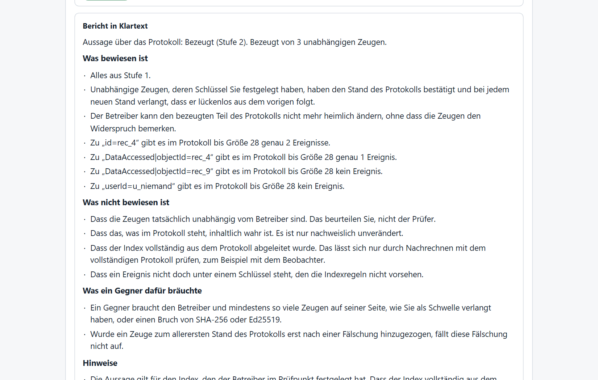
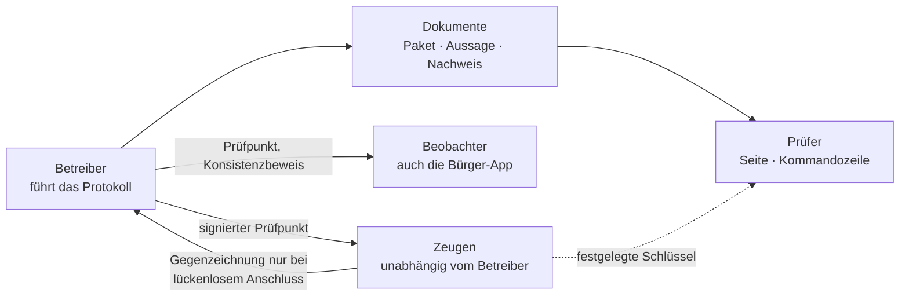

<div align="center">

<picture>
  <source media="(prefers-color-scheme: dark)" srcset="docs/assets/defconder-logo-dunkel.svg">
  
</picture>

# Prüfer

**Nachprüfen, statt zu glauben.** Offene Werkzeuge, mit denen sich Aussagen über ein manipulationssicheres Protokoll ohne die Anwendung dahinter überprüfen lassen: im Browser, auf der Kommandozeile und in drei Umsetzungen.

[](https://github.com/defconder/pruefer/actions/workflows/tests.yml)
[](LICENSE)


[Schnellstart](#schnellstart) · [Dokumentarten](#dokumentarten) · [Funktionsweise](#funktionsweise) · [Spezifikation](pruefer/SPEZIFIKATION.md) · [Bedrohungsmodell](pruefer/BEDROHUNGSMODELL.md) · [English](README.en.md)

</div>

---

## Worum es geht

Wer ein Protokoll führt, kann es umschreiben, und wer eine Prüfsumme veröffentlicht, die er selbst erzeugt hat, beweist damit wenig. Der Prüfer rechnet deshalb alles selbst nach und sagt bei jedem Ergebnis, wie weit es trägt. Er braucht weder Netz noch die Anwendung, aus der das Dokument stammt. Die Seite darf technisch keine Verbindung aufbauen, das erzwingt eine Content-Security-Policy.

Das Verfahren stammt aus der Transparenz-Szene der Zertifikate und Softwarelieferketten: ein Merkle-Baum nach RFC 9162, signierte Prüfpunkte, unabhängige Zeugen, die einen neuen Stand nur gegenzeichnen, wenn er lückenlos aus dem alten folgt. Darauf setzen weitere Bausteine auf: Beweise für das, was **nicht** im Protokoll steht, Entscheidungsnachweise gegen veröffentlichte Regeln und Auszüge, die Felder verdecken, ohne die Prüfsumme zu brechen.

## So sieht es aus

<picture>
  <source media="(prefers-color-scheme: dark)" srcset="docs/bilder/pruefer-ergebnis-dunkel.png">
  
</picture>

Jedes Ergebnis kommt mit einem Bericht in Klartext: was bewiesen ist, was nicht, was ein Gegner dafür bräuchte und was als Nächstes zu tun ist.

<picture>
  <source media="(prefers-color-scheme: dark)" srcset="docs/bilder/pruefer-bericht-dunkel.png">
  
</picture>

## Vertrauensstufen

| Stufe | Bedeutung | Was dafür nötig ist |
|:---:|---|---|
| **0** | Das Dokument ist in sich stimmig und seit seiner Erstellung unverändert. | nichts |
| **1** | Es stammt vom Inhaber eines Schlüssels, den Sie auf anderem Weg erhalten haben. | Schlüsselkennung oder Protokollschlüssel festlegen |
| **2** | Unabhängige Zeugen haben den Stand des Protokolls bestätigt, den das Dokument voraussetzt. | Protokollschlüssel, Zeugenschlüssel und eine Schwelle festlegen |

Stufe 0 beweist **nicht**, von wem ein Dokument stammt: Ein Dokument bringt seinen eigenen Schlüssel mit. Das schreibt der Prüfer in jedes Ergebnis. Wer mehr verlangt, setzt `--mindeststufe`, dann gilt ein Dokument unterhalb davon als nicht bestanden.

## Dokumentarten

| Dokument | Es beweist |
|---|---|
| **Beweispaket** | Eine Datei und alle ihre Ereignisse, Analysen und Beweise sind unverändert. Einzelne Ereignisse können als Auszug mit verdeckten Feldern beiliegen. |
| **Aussage über das Protokoll** | „Zu diesem Schlüssel gibt es genau diese Ereignisse“ oder „es gibt keine“, zum Beispiel: Dieser Datensatz wurde nie abgerufen. |
| **Entscheidungsnachweis** | Eine Zugriffsentscheidung entsprach der Regel, die vorher im Protokoll veröffentlicht war. |
| **Widerspruchsbeweis** | Das Protokoll hat für dieselbe Größe zwei verschiedene Wurzeln unterschrieben. Das kann jeder nachrechnen. |
| **Prüfpunkt** | Der signierte und gegengezeichnete Stand, gegebenenfalls mit Index und Zeitanker. |

## Funktionsweise



**Merkle-Baum und Konsistenz.** Jedes Ereignis ist ein Blatt. Ein Einschlussbeweis zeigt, dass ein Ereignis im Baum steht, ein Konsistenzbeweis, dass ein größerer Baum den kleineren unverändert enthält (RFC 6962, RFC 9162).

**Zeugen und Beobachter.** Ein Zeuge merkt sich den letzten Stand und zeichnet nur gegen, wenn der neue lückenlos darauf aufbaut. Ein Beobachter holt Prüfpunkte laufend und schlägt Alarm bei Rücksetzung, Umschreiben oder zwei verschiedenen Wurzeln für dieselbe Größe. Das Letzte ist ein Beweis, den jeder nachrechnen kann.

**Feldbaum und Auszüge.** Ein Ereignis besteht aus einem Baum seiner Felder, jedes Feld mit eigenem Salz. Die Prüfsumme hängt nur an der Wurzel dieses Baums. Zeigt man ein Feld, legt man dessen Salz offen, die übrigen bleiben als Blattprüfsummen verdeckt und das Ereignis bleibt im Protokoll nachprüfbar.

**Index und Beweis des Fehlenden.** Zu jedem Schlüssel (Nutzer, Datensatz, Ereignistyp) führt der Betreiber eine Kette der zugehörigen Ereignisse. Die Schlüssel stehen sortiert in einem zweiten Baum, dessen Wurzel im Prüfpunkt mitunterschrieben wird. „Kein Ereignis“ beweist man mit zwei benachbarten Einträgen, zwischen denen der Schlüssel nicht liegt.

**Regeln und Belege.** Regeln einer kleinen Regelsprache stehen als Ereignis im Protokoll, bevor sie angewandt werden. Ein Beleg nennt Regel, Eingaben und Ergebnis, der Prüfer rechnet die Regel selbst durch, auch alle Randfälle.

**Zeitanker.** Optional trägt ein Prüfpunkt den Kopf des neuesten Bitcoin-Blocks. Der Prüfer rechnet dessen Arbeitsnachweis nach. Das belegt, dass der Prüfpunkt nicht früher entstand, aber nicht, dass er nicht später entstand.

## Verwandte Arbeiten

Die Bausteine kommen aus der Transparenz-Szene: Certificate Transparency und RFC 9162, Go sumdb, Sigstore, Sigsum, die Formate von [C2SP](https://c2sp.org) und das Zeugennetz von [transparency.dev](https://transparency.dev). Für den Index und den Beweis des Fehlens ist die engste verwandte Arbeit der verifizierbare Index (vindex) im Incubator von transparency-dev, der einen Präfixbaum auf Basis von AKD verwendet, dazu die Literatur zu Schlüsseltransparenz (CONIKS, AKD). Wir benutzen einen einfachen, sortierten Baum, der sich leichter umsetzen und prüfen lässt und beim Aktualisieren mehr kostet. Wo wir von diesen Arbeiten abweichen oder etwas übersehen haben, sind wir für Hinweise dankbar.

## Schnellstart

Voraussetzung ist Node ab Version 20. Ohne Installation, ohne Abhängigkeiten:

```bash
git clone https://github.com/defconder/pruefer.git && cd pruefer/pruefer

node pruefer.mjs beweispaket.json original.pdf --bericht
node pruefer.mjs aussage aussage.json --log-schluessel "betreiber.example/log+1a2b3c4d+AQ..." --zeugen-datei zeugen.txt --mindeststufe 2
node pruefer.mjs entscheidung nachweis.json --log-schluessel "..." --bericht
node pruefer.mjs widerspruch beweis.json --log-schluessel "..."
node pruefer.mjs pruefpunkt pruefpunkt.txt --log-schluessel "..." --zeugen-datei zeugen.txt
```

Oder `pruefer/pruefer.html` im Browser öffnen. Rückgabewert 0 heißt bestanden, 1 nicht bestanden, 2 fehlerhafter Aufruf.

Einen Zeugen oder Beobachter starten:

```bash
node zeuge/zeuge.mjs --name zeuge.example.org --log "<Schlüssel des Protokolls>" --port 8801
node beobachter/beobachter.mjs --quelle https://betreiber.example --log "<Schlüssel>" --zeuge "<Schlüssel des Zeugen>" --schwelle 1
```

## Drei Umsetzungen, ein Satz Testvektoren

Der Prüfer liegt in JavaScript, Python und Rust vor, alle drei gegen die Spezifikation geschrieben. Alle drei bestehen dieselben Testvektoren: Baumwurzeln, mehr als dreihundert Konsistenzbeweise, Prüfpunkte mit gültigen, fehlenden und gefälschten Signaturen, Ereignisse beider Formate mit Veränderungen, Auszüge, Aussagen, Zeitanker und Belege.

```bash
node pruefer/testvektoren/pruefen.mjs
python pruefer/python/pruefen_vektoren.py
cargo run --release --manifest-path pruefer/rust/Cargo.toml -- pruefer/testvektoren/testvektoren.json
```

Die Formate sind so genau beschrieben, dass man den Prüfer in einer vierten Sprache nachbauen kann: [Spezifikation](pruefer/SPEZIFIKATION.md) ([English](pruefer/SPECIFICATION.en.md)).

## Ist die Seite, die ich benutze, echt?

`node pruefer/release.mjs` baut `pruefer.html` aus den Quellen und schreibt Prüfsummen, eine Liste der Bestandteile (CycloneDX) und ein signiertes Manifest. Der Bau ist reproduzierbar, zweimal gebaut ergibt dieselbe Prüfsumme. Vergleichen Sie die Prüfsumme Ihrer Kopie mit der in der Ankündigung der jeweiligen Fassung.

## Grenzen

Das gehört in dieses Dokument, damit niemand mehr hineinliest, als drinsteht.

- Es gab **kein unabhängiges Sicherheitsaudit**. Der Prüfer ist klein, hat keine Laufzeitabhängigkeiten und ist gegen drei Umsetzungen getestet. Das ersetzt kein Audit.
- Die drei Umsetzungen stammen von derselben Hand. Sie finden Fehler in der Spezifikation und in Randfällen, ersetzen aber keine Umsetzung durch Dritte.
- Stufe 2 ist nur so stark wie die **Unabhängigkeit der Zeugen**, und das beurteilen Sie, nicht der Prüfer. Zeugen vertrauen dem Betreiber beim allerersten Stand.
- Signaturen sind Ed25519. Nachquantensichere Verfahren sind in Browsern und der eingesetzten Node-Fassung noch nicht verfügbar.
- Es gibt **keinen qualifizierten Zeitstempel** nach eIDAS. Der Bitcoin-Zeitanker belegt „nicht früher als“.
- Eine Aussage über das Protokoll gilt für den Index, den der Betreiber festgelegt hat. Ob er vollständig ist, lässt sich nur mit dem vollständigen Protokoll nachrechnen, zum Beispiel mit dem Beobachter.
- Ein Entscheidungsnachweis zeigt, dass nach der veröffentlichten Regel entschieden wurde, nicht dass Eingaben oder Regel fachlich richtig sind.
- Rechtliche Wirkung vor Gericht ist nicht Gegenstand dieses Werkzeugs.

Das vollständige [Bedrohungsmodell](pruefer/BEDROHUNGSMODELL.md) benennt für jeden Angreifer und jede Stufe, was abgewehrt wird.

## Zeugen und Beobachter gesucht

Der Prüfer wird erst stark, wenn Dritte mitmachen. Wer einen Zeugen betreiben oder einen Beobachter laufen lassen will, ob als Organisation, Aufsicht, Forschungsgruppe oder Einzelperson, findet in [`zeuge`](zeuge/README.md) und [`beobachter`](beobachter/README.md) alles dafür. Fehler, Lücken in der Spezifikation und unabhängige Umsetzungen sind ausdrücklich willkommen, siehe [CONTRIBUTING.md](CONTRIBUTING.md).

## Sicherheit und Lizenz

Sicherheitslücken bitte vertraulich melden, siehe [SECURITY.md](SECURITY.md). Lizenz: [Apache-2.0](LICENSE).

<div align="center">

Teil von **Defconder**, einer souveränen Lage- und Führungsschicht. [defconder.de](https://defconder.de)

</div>
